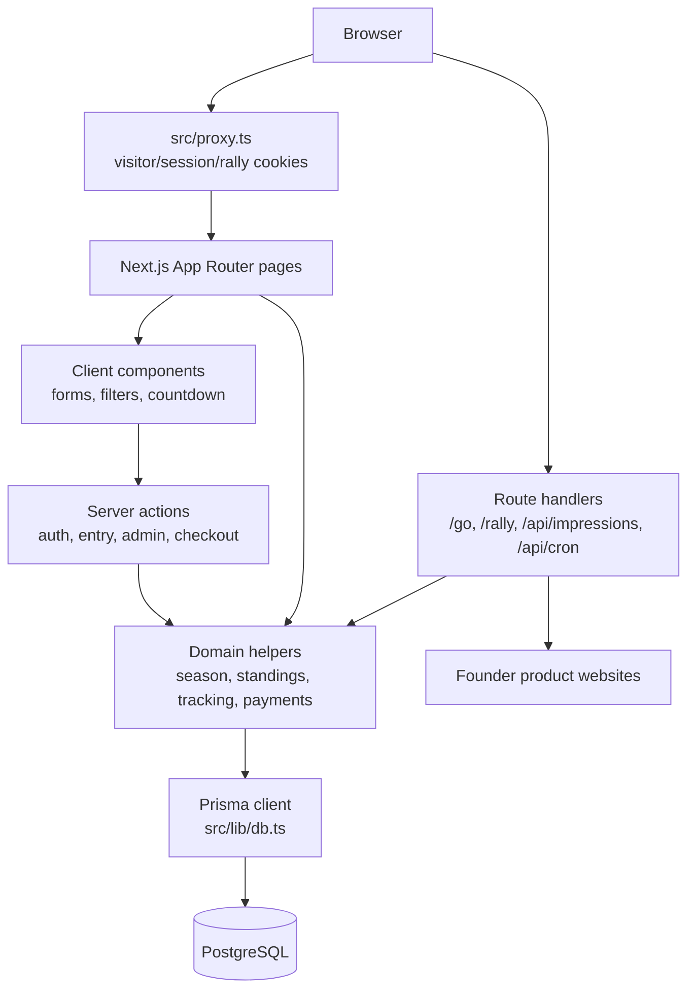

# Surviver.lol Architecture

Status: implementation map verified against the repository on 2026-09-08.

## System at a glance

Surviver.lol is a Next.js App Router application backed by PostgreSQL through Prisma. It runs a paid, promotion-oriented SaaS tournament: founders submit a product, payment is recorded, an administrator reviews the submission, and approved entries appear on a public discovery board. Public interaction is intended to produce competition data; founders can view campaign statistics through either an authenticated dashboard or a secret entry-management URL.



## Runtime boundaries

### Server

- App Router pages are Server Components by default and query Prisma directly.
- `src/lib/db.ts`, `src/lib/auth/*`, `src/lib/competition/*`, `src/lib/payments/*`, `src/lib/products/site-metadata.ts`, and `src/lib/tracking/visitor.ts` are server-side domain code. Several use `server-only` to prevent accidental client imports.
- Server actions are the mutation boundary for signup, signin, signout, entry creation, admin review, and the development checkout.
- `src/proxy.ts` runs before matched requests and assigns opaque visitor/session cookies. It also captures a Rally code from the query string.

### Client

The client boundary is intentionally narrow:

- `CategoryBar` handles pathname/search-param-driven category filtering.
- `Countdown` renders a client-clock countdown corrected against a server timestamp.
- `ImpressionTracker` reports a view after the card remains at least 50% visible for one second.
- `EntryForm` manages lookup, field state, preview, and `useActionState` submission.
- `CredentialsForm` manages server-action form state.
- Error boundaries are client components so they can call `reset`.

There is no client-side data cache, API client, or client-owned scoring state. The server remains authoritative for database state and permissions.

## Route and layout architecture

```text
src/
├── proxy.ts                            request cookie bootstrap
└── app/
    ├── layout.tsx                     root metadata, fonts, global CSS
    ├── globals.css                    Tailwind v4 theme and design tokens
    ├── (site)/
    │   ├── layout.tsx                 public header + main + footer
    │   ├── page.tsx                   landing page
    │   ├── board/page.tsx             shuffled discovery board
    │   ├── leaderboard/page.tsx       ranked live standings
    │   ├── seasons/page.tsx           season index
    │   ├── seasons/[number]/page.tsx  live/archive season detail
    │   ├── survivors/page.tsx         completed winners
    │   ├── enter/page.tsx             entry form and capacity display
    │   ├── enter/checkout/[paymentId]/ development checkout simulator
    │   ├── entry/[token]/page.tsx     secret campaign-management page
    │   ├── dashboard/page.tsx         authenticated founder dashboard
    │   ├── admin/page.tsx             admin review and audit summary
    │   ├── admin/actions.ts           admin approval/rejection actions
    │   ├── loading.tsx                public loading UI
    │   └── error.tsx                  public route error boundary
    ├── (auth)/
    │   ├── layout.tsx                 auth shell
    │   ├── login/page.tsx             signin page
    │   └── signup/page.tsx            signup page
    ├── go/[slug]/route.ts             tracked outbound redirect
    ├── rally/[code]/route.ts          Rally landing redirect
    ├── api/impressions/route.ts       qualified impression ingestion
    ├── api/cron/rounds/route.ts       protected round advancement
    ├── not-found.tsx                  404 UI
    └── global-error.tsx               root failure UI
```

Route groups `(site)` and `(auth)` do not appear in URLs. The current build reports these public paths:

`/`, `/admin`, `/board`, `/dashboard`, `/enter`, `/enter/checkout/[paymentId]`, `/entry/[token]`, `/go/[slug]`, `/how-it-works`, `/leaderboard`, `/login`, `/rally/[code]`, `/rules`, `/seasons`, `/seasons/[number]`, `/signup`, and `/survivors`.

## Main request flows

### Founder entry and payment

```mermaid
sequenceDiagram
    participant F as Founder browser
    participant E as /enter
    participant A as createEntryAction
    participant DB as PostgreSQL
    participant P as PaymentProvider
    participant C as Dev checkout
    participant M as /entry/[token]

    F->>E: Load open season and capacity
    F->>A: Fetch product metadata (optional)
    A-->>F: Prefill title, description, image, favicon
    F->>A: Submit product, email, category, rules
    A->>DB: Validate season, capacity, duplicate URL
    A->>DB: Upsert guest User; create Product, SeasonEntry, Payment
    A->>P: Create checkout session
    P-->>F: Redirect to checkout URL
    F->>C: Simulate success or failure (dev only)
    C->>DB: applyPaymentResult
    DB-->>C: Payment + entry state updated
    C-->>M: Redirect to secret manage link after success
```

Important state transitions:

1. New entry: `SeasonEntry.AWAITING_PAYMENT`, `Payment.PENDING`, `Product.DRAFT`.
2. Successful payment: `Payment.SUCCEEDED`, `SeasonEntry.AWAITING_APPROVAL`, `Product.PENDING`.
3. Admin approval: `Product.APPROVED`; entry becomes `UPCOMING` unless the season is already running, in which case it becomes `ACTIVE`.
4. Admin rejection: `Product.REJECTED`, `SeasonEntry.REJECTED`, and an audit record marking that a refund is owed.

The payment abstraction is ready for a provider implementation, but the only registered provider is `dev`. No real provider webhook route exists yet.

### Public discovery and outbound tracking

```mermaid
sequenceDiagram
    participant V as Visitor
    participant X as proxy
    participant B as /board
    participant G as /go/[slug]
    participant DB as PostgreSQL
    participant S as Product website

    V->>X: Request page
    X-->>V: Opaque visitor + rolling session cookies
    V->>B: Load board
    B->>DB: Read current season, active round, stats
    B-->>V: Exposure-balanced cards
    V->>DB: Qualified impression after visibility threshold
    V->>G: Click product
    G->>DB: Read approved product + current entry
    G->>DB: Record ClickEvent; increment verified visits if eligible
    G-->>S: 302 redirect to stored http(s) URL
```

Click rules currently implemented in `/go/[slug]`:

- Unknown, unapproved, or unsafe destinations redirect back to `/board`.
- Only an active round can receive scoring clicks.
- Eliminated entries keep their outbound link, but later clicks do not score.
- A visitor's first qualifying click per entry per round increments `verifiedVisits` only after a qualified impression.
- Discovery clicks and Rally clicks are separated.
- A Rally visitor clicking the referring founder's own product is stored as `RALLY_SELF` and never scores.
- Tracking errors are logged but do not block the requested outbound redirect.

The board prioritizes underexposed entries, applies a bounded Rally exposure boost, and uses visitor-specific deterministic tie-breaking so products receive fair exposure without sorting the discovery page by performance.

### Rally

`/rally/[code]` validates the code, then redirects to `/board?rally=<code>`. The proxy stores that code in a short-lived, httpOnly cookie. Tracking classifies Rally traffic, prevents self-scoring, creates visitor attribution, and awards one Rally point after the visitor qualifies views on two other products.

### Authentication and authorization

```mermaid
flowchart LR
    Signup[/signup] -->|signUpAction| Hash[bcrypt hash]
    Login[/login] -->|signInAction| Verify[bcrypt verify]
    Hash --> Session[Session row + auth cookie]
    Verify --> Session
    Session --> Guard[requireUser / requireAdmin]
    Guard --> Dashboard[/dashboard]
    Guard --> Admin[/admin]
```

- The browser holds a random auth token; the database stores only its SHA-256 hash.
- Sessions expire after 30 days and refresh with a sliding expiry.
- Passwords use bcrypt with 12 rounds. Unknown users use a dummy hash comparison to reduce account-enumeration timing leaks.
- `requireUser` redirects unauthenticated users to `/login`.
- `requireAdmin` redirects unauthenticated users to login and non-admin users to `/`.
- The entry flow intentionally supports guest founders. A guest `User` may have no password; the `manageToken` on `SeasonEntry` is the capability link for campaign access.

## Data architecture

The canonical model is `prisma/schema.prisma`; the generated client in `src/generated/prisma` is derived output and should not be edited by hand.

```text
User
├── Product[]
├── Session[]
├── Payment[]
└── AdminAction[]

Season
├── SeasonEntry[] ── Product
├── Round[]
└── Payment[]

SeasonEntry
├── Payment?
├── ProductRoundStats[] ── Round
├── ImpressionEvent[]
├── ClickEvent[]
├── RallyVisitor[]
└── ActivityEvent[]
```

Core aggregates:

- `Season`: lifecycle, capacity, pricing, timing, sample threshold, round defaults, Rally settings, and deduplication settings.
- `SeasonEntry`: one product's participation in one season; owns status, public Rally code, private manage token, and final/elimination references.
- `Round`: time window, elimination count, lifecycle status, and finalization timestamp.
- `ProductRoundStats`: per-entry/per-round scoreboard snapshot. Unique on `(roundId, seasonEntryId)` and marked immutable by convention after finalization.
- `ImpressionEvent` and `ClickEvent`: raw event records with visitor/session IDs, source type, suspicion flags, and hashed IP metadata.
- `RallyVisitor`: intended attribution record for a visitor brought by a founder.
- `Payment`: internal payment record with provider ID, status, refund totals, and webhook idempotency marker.
- `AdminAction`: audit trail for manual decisions.
- `ActivityEvent`: immutable public and administrative timeline records emitted by payment, review, and competition transitions.

## Scoring implementation boundary

The competition engine is executable and transactionally serialized on the season row.

Implemented:

- Read helpers for current/open seasons, active rounds, round lists, capacity, and standings.
- Sample-threshold presentation via `collecting` when qualified impressions are below `Season.minSampleImpressions`.
- Rank movement display from `prevRank`.
- Qualified-impression ingestion with dwell and visibility thresholds.
- Impression and visit deduplication, source classification, and bot/headless rejection.
- Deterministic interest-rate ranking with minimum-sample eligibility and stable tie-breaking.
- Exposure balancing and capped Rally boosts.
- Transactional round start, low-sample extension, finalization, elimination, and survivor transitions.
- Activity-event emission and a scheduler endpoint protected by `CRON_SECRET`.

The remaining payment work is the real Dodo Payments provider, signature verification, webhook handler, and refund execution. Development continues to use the explicit simulator.

## Security and trust boundaries

- `normalizeUrl` and `fetchSiteMetadata` treat founder URLs as hostile input: only http(s), no credentials, DNS resolution against private ranges, manual redirect validation, a six-second timeout, and a 512 KiB response cap.
- Stored outbound destinations are checked again before redirecting.
- Raw IP addresses are not stored; `hashIp` salts and truncates a SHA-256 digest.
- Auth cookies, visitor cookies, session cookies, Rally cookies, and the pending-payment cookie are httpOnly and use `SameSite=Lax`.
- Internal `next` redirects accept only single-slash paths, preventing open redirects.
- Public product links use `nofollow sponsored`; the application does not pass ranking authority to paid destinations.
- Server-side role checks protect admin operations; visible UI is not treated as authorization.

## Deployment and extension seams

- Database access is centralized in `src/lib/db.ts` using `PrismaPg` and the generated Prisma client.
- Environment reads are centralized and lazy in `src/lib/env.ts`.
- Payment providers implement `PaymentProvider` in `src/lib/payments/types.ts`; `applyPaymentResult` is the shared idempotent fulfillment path.
- Add a real provider by implementing checkout creation and signed webhook parsing, registering it in `src/lib/payments/index.ts`, and adding a route that calls `applyPaymentResult`.
- Schedule authenticated calls to `/api/cron/rounds` in the deployment platform.
- Keep pages dynamic while competition state is live; the current live pages explicitly use `dynamic = "force-dynamic"`.
